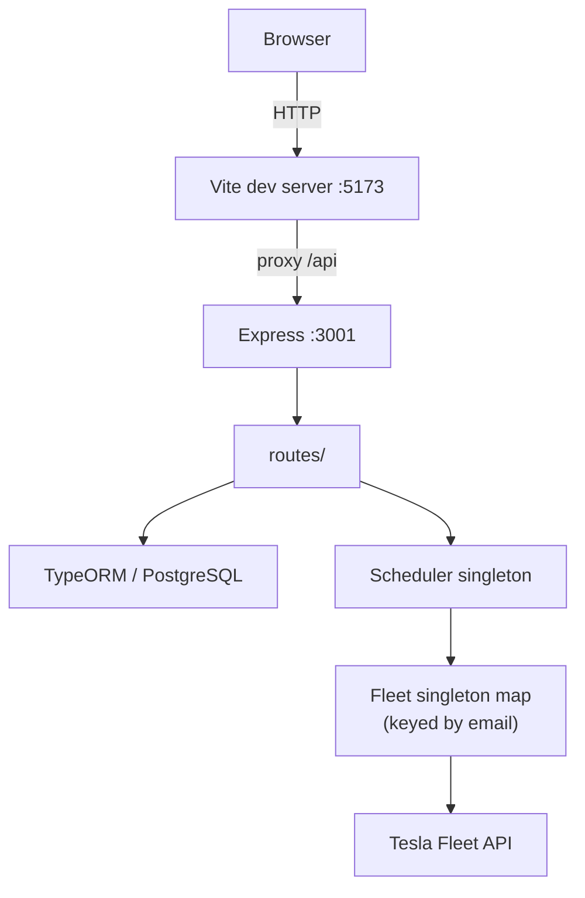

# CLAUDE.md

This file provides guidance to Claude Code (claude.ai/code) when working with code in this repository.

- [CLAUDE.md](#claudemd)
  - [Commands](#commands)
  - [Environment setup](#environment-setup)
  - [Architecture](#architecture)
    - [Request flow](#request-flow)
    - [Fleet singleton map](#fleet-singleton-map)
    - [Scheduler singleton](#scheduler-singleton)
    - [Schedule execution](#schedule-execution)
  - [Key conventions](#key-conventions)
    - [Request validation](#request-validation)
    - [Security conventions for new routes](#security-conventions-for-new-routes)

## Commands

```sh
# Start dependencies (PostgreSQL)
bun run docker:up

# Development (run both concurrently)
bun run dev:server   # Express backend on :3001 with nodemon hot-reload
bun run dev:client   # Vite frontend on :5173, proxies /api → :3001

# Lint (prettier + eslint + stylelint + tsc)
bun run lint

# Full verification (lint + type-check + tests + dependency audit) — run before committing
bun run verify

# Tests
bun test
bun test --watch
bun test path/to/file.test.ts   # run a single test file

# Generate a new Tesla refresh token (OAuth browser flow)
bun run new-refresh-token

# Production
bun run build          # bundles server → build/
bun run build-client   # tsc + vite build → dist/
bun run start
```

## Environment setup

Copy `env/sample.env` to `.env`. Required variables:

| Variable | Purpose |
| --- | --- |
| `TESLA_CLIENT_ID` / `TESLA_CLIENT_SECRET` | Tesla Fleet API app credentials |
| `TESLA_REDIRECT_URI` | OAuth redirect (`http://localhost:3001/callback` for dev) |
| `TESLA_AUTH_BASE_URL` / `TESLA_API_BASE_URL` | Tesla API endpoints (defaults to NA) |
| `DATABASE_*` | PostgreSQL connection |
| `SMTP_*` | Nodemailer config for error/notification emails |
| `SCHEDULED_JOBS_DISABLED` | Set `true` to prevent cron jobs from firing on startup |

Tesla Fleet API onboarding (registering a Developer app, generating keypairs, and region registration) is documented in `README.md`.

## Architecture

The app is a single Bun process serving both the Express API and static frontend assets, backed by PostgreSQL via TypeORM.



- **`src/server/`** — Express app, routes, TypeORM entities, utilities
- **`src/client/`** — React 19 + Vite + MUI frontend
- **`src/server/bootstrap/logger-global.ts`** — loaded by `bunfig.toml` preload; injects `logger` (Pino) as a global — no import needed anywhere in server code
- **`src/server/types/common.ts`** — shared types for Tesla API responses (`Product`, `LiveStatus`, `SiteInfo`, `TokenData`, etc.)

### Request flow

Express routes in `src/server/routes/` delegate to DB accessor functions in `src/server/util/routes/` (thin wrappers over TypeORM repositories), then interact with the `Scheduler` or `Fleet` singletons for side effects.

### Fleet singleton map

`Fleet` (`src/server/util/fleet.ts`) is a **per-email singleton** — `Fleet.getInstance(email)` returns or creates one instance per user. Each instance manages its own access/refresh token lifecycle, auto-refreshing when expired.

`_actionMap` is built dynamically in the constructor by reflecting over all methods whose name starts with `set` (e.g. `setBackupReserve`, `setSoftBackupReserve`). When adding a new Powerwall command, name it `set*` and it becomes available automatically in schedules.

### Scheduler singleton

`Scheduler` (`src/server/util/scheduler.ts`) is a global singleton. At startup, it loads all schedules from the DB, validates each (email must have a refresh token, schedule must be enabled, non-expired, and have actions), and registers them with `node-cron`.

A schedule is only registered if its email exists in the `refresh_token` table. Adding support for a new user requires storing their refresh token first.

### Schedule execution

Each cron tick:

1. Fetches energy products from Tesla API for the schedule's `device_id` (or all if `"ALL"`)
2. Iterates `schedule.configuration` items, resolving each `action` string through `Fleet._actionMap`
3. Writes `last_run_time`, `next_run_time`, and success/error fields back to the DB

## Accepted security findings

Security issues that were consciously assessed and accepted rather than fixed. Do not re-raise these in future audits unless the threat model changes.

**Outbound `fetch()` to Tesla Fleet API carries no custom TLS dispatcher** *(assessed 2026-06-21)*

Node.js / Bun validate TLS certificates by default (`rejectUnauthorized: true`). A custom agent with the same default adds no protection: it cannot defend against a compromised OS trust store (the only meaningful upgrade would be certificate pinning, which is brittle and breaks silently on Tesla cert rotation). There is no `rejectUnauthorized: false` anywhere in the codebase.

## Key conventions

- **Dependency audit** — `bun run verify` ends with `bun audit` and fails if vulnerabilities are found. When it fails, surface the findings to the user and discuss the appropriate fix together — the options include `bun update` (latest compatible versions), `bun update --latest` (allows major version bumps, may introduce breaking changes), or an `overrides` entry in `package.json` to pin a specific transitive dependency. Do not silently apply overrides or auto-update without the user's input.
- **Path alias** — `~/` maps to `src/` (configured in `tsconfig.json` and Vite). Use it for all cross-module imports within `src/`.
- **TypeORM Entity Schema** — models use `EntitySchema` (not decorators). See `src/server/database/models/` for the pattern.
- **JSONB columns** — `conditions`, `actions`, and `configuration` on `Schedule` are JSONB; TypeORM maps them to typed arrays.
- **Retry utility** — `src/server/util/retry.ts` wraps async calls with configurable attempts, delay, and backoff. All Tesla API calls use it with 3 attempts.
- **Error email notifications** — `sendEmail` from `src/server/util/mailing.ts` is called on Fleet errors when `mailOnError` is set; the email goes to the schedule owner.

### Request validation

Every new route that accepts a request body **must** validate it with Zod before touching the data:

1. Add or extend a schema in `src/shared/schemas/` — schemas live there (not under `server/` or `client/`) so they can be imported from both Express routes and React form validation.
2. Import `validateBody` from `~/server/middleware/validateBody` and add it to the middleware chain before the route handler.
3. Export a `z.infer<typeof Schema>` type alias alongside each schema for use in the frontend.

```typescript
// src/shared/schemas/example.ts
import { z } from "zod";
export const ExampleSchema = z.object({ name: z.string().min(1) });
export type ExampleInput = z.infer<typeof ExampleSchema>;

// src/server/routes/example.ts
import { validateBody } from "~/server/middleware/validateBody";
import { ExampleSchema } from "~/shared/schemas/example";
router.post("/example", validateBody(ExampleSchema), async (req, res) => { … });
```

> **Zod v4 note:** `z.record()` requires explicit key and value types — use `z.record(z.string(), z.unknown())`, not `z.record(z.unknown())`.

### Security conventions for new routes

- **PII in logs** — never log a raw email address. Use `maskEmail(email)` from `~/server/util/maskEmail`. Log the user's UUID (`userId`) alongside the masked email wherever the DB record is in scope.
- **Error propagation** — catch blocks must call `next(error)` rather than formatting a `res.status(500).json(...)` response directly. The centralized error handler in `main.ts` returns a generic message in production and the real message only in `NODE_ENV=development`.
- **No `error.message` in responses** — do not put `error.message` (or any internal exception detail) into a JSON response body. Route-level `logger.error` calls with structured context are fine; the HTTP response must be generic.
