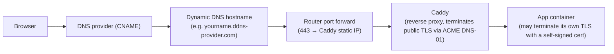

# Reverse Proxy / TLS Setup — Handover Notes

- [Reverse Proxy / TLS Setup — Handover Notes](#reverse-proxy--tls-setup--handover-notes)
  - [Stack Overview](#stack-overview)
  - [Gotchas Hit During Setup (read before adding a new app)](#gotchas-hit-during-setup-read-before-adding-a-new-app)
    - [1. Backend apps may terminate their own TLS](#1-backend-apps-may-terminate-their-own-tls)
    - [2. CORS allowlists break once a public domain is added](#2-cors-allowlists-break-once-a-public-domain-is-added)
    - [3. Debugging checklist for a new app behind Caddy](#3-debugging-checklist-for-a-new-app-behind-caddy)
  - [Adding a New App — Quick Recipe](#adding-a-new-app--quick-recipe)
  - [Known Active Hostnames](#known-active-hostnames)

Context for future maintainers when adding new apps behind Caddy on the QNAP NAS, or when
debugging similar issues in `tesla-powerwall-automation` or future services.

## Stack Overview



- **Domain**: a custom domain registered and DNS-managed via a provider that supports API-driven
  DNS-01 challenges (e.g. Cloudflare), with proxying/CDN features disabled ("DNS-only" mode) so
  DNS-01 challenges and direct home-IP routing work cleanly.
- **Cert issuance**: Caddy's built-in ACME client using a DNS provider plugin (e.g.
  `caddy-dns/cloudflare`). No manual cert files, no certbot, no renewal cron — Caddy handles it
  all automatically (renewal window kicks in ~60 days into a 90-day cert lifetime).
- **Caddy container**: runs on the NAS (e.g. via Container Station), with a static internal IP,
  host-bound volumes for `/data` (RW, cert storage) and `/config` (RW, runtime state), and a
  read-only bind mount for `/etc/caddy/Caddyfile`.
- **Router**: a dynamic DNS client keeps a hostname pointed at the home IP. External port 443 is
  forwarded to Caddy's static internal IP. Port 80 is NOT forwarded (not needed — DNS-01 doesn't
  require it).

## Gotchas Hit During Setup (read before adding a new app)

### 1. Backend apps may terminate their own TLS

Some backend apps (e.g. `tesla-powerwall-automation`) serve HTTPS internally with a
**self-signed cert** (CN = its own LAN IP). If Caddy's `reverse_proxy` directive points at it
with plain `http://`, the backend just drops the connection (curl shows "Empty reply from
server" — not an obvious TLS clue).

**Fix pattern** — check whether a target app talks HTTP or HTTPS internally
(`curl -vk https://<internal-ip>:<port>` from inside the Caddy container is the fastest test)
and if HTTPS with a self-signed cert, use:

```caddyfile
reverse_proxy https://<internal-ip>:<port> {
    transport http {
        tls_insecure_skip_verify
    }
}
```

`tls_insecure_skip_verify` is safe here because that hop stays inside the trusted home LAN —
the public-facing hop (browser → Caddy) still uses the real publicly-trusted cert.

### 2. CORS allowlists break once a public domain is added

Apps with a hardcoded/env-based CORS origin allowlist (e.g. `ALLOWED_ORIGINS`) will reject
requests once they arrive with `Origin: https://yourapp.example.com` instead of the LAN origin
they were configured for. Symptom looked like a Caddy/proxy failure (500s on static assets like
JS/CSS, HTML loaded fine) but was actually the app's own CORS middleware throwing and its error
handler returning a 500.

**Diagnostic tell**: failing responses had `X-Powered-By: Express` and a tiny JSON error body —
i.e. coming from the app, not from Caddy.

**Fix**: add every public hostname you intend to expose (and keep the LAN origin too, for direct
local access) to the app's `ALLOWED_ORIGINS` env var, then restart that app's container — not
Caddy.

### 3. Debugging checklist for a new app behind Caddy

When wiring up the Nth app, work through this order — it matches the failure modes actually
hit in practice:

1. **DNS/cert layer**: does `https://newapp.example.com` resolve and get a valid cert? (Check
   Caddy startup logs for `certificate obtained successfully`.)
2. **Network reachability**: from inside the Caddy container, `curl -v http://<internal-ip>:<port>`
   — connects? Empty reply often means the backend actually wants HTTPS (see gotcha #1).
3. **Backend protocol**: if HTTP gets an empty reply, retry with `curl -vk https://<internal-ip>:<port>`.
   If that returns real content, update the Caddyfile to proxy over HTTPS with
   `tls_insecure_skip_verify`.
4. **Enable Caddy access logs** (`log { output stdout }` in the site block) before chasing
   further errors — the default startup log shows none of the actual per-request traffic.
5. **Check for asset-specific failures**: if the root page loads but JS/CSS/API calls 500, check
   response headers for `X-Powered-By` / framework fingerprints — that's the app's own error, not
   Caddy's. Compare `Origin` header on failing vs. succeeding requests; CORS is the usual
   suspect.
6. Only after 1–5 are ruled out should you suspect a genuine Caddyfile routing/matcher issue.

## Adding a New App — Quick Recipe

1. DNS provider → add CNAME: `newapp` → your dynamic DNS hostname (DNS-only, no proxying).
2. Add a new site block to the Caddyfile (or extend an existing multi-hostname block if it
   routes to the same backend):

   ```caddyfile
   newapp.example.com {
       tls {
           dns cloudflare {env.CLOUDFLARE_API_TOKEN}
       }
       reverse_proxy <http|https>://<internal-ip>:<port> {
           # only if backend uses self-signed HTTPS:
           transport http {
               tls_insecure_skip_verify
           }
       }
       log {
           output stdout
       }
   }
   ```

3. Restart the Caddy container — Caddy will auto-request the new cert on startup.
4. If the app has a CORS allowlist, add the new public hostname to it and restart that app's own
   container.
5. No router changes needed — 443 is already forwarded to Caddy for all hostnames.

## Known Active Hostnames

Track the public hostnames currently routed through Caddy here, and prune unused aliases once
a setup is settled (e.g. keep one canonical hostname per app, remove redundant CNAMEs and
Caddyfile entries).
